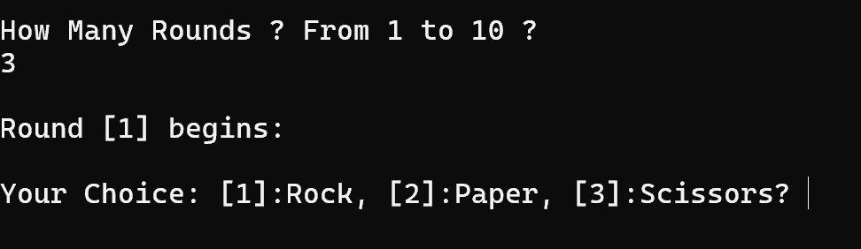
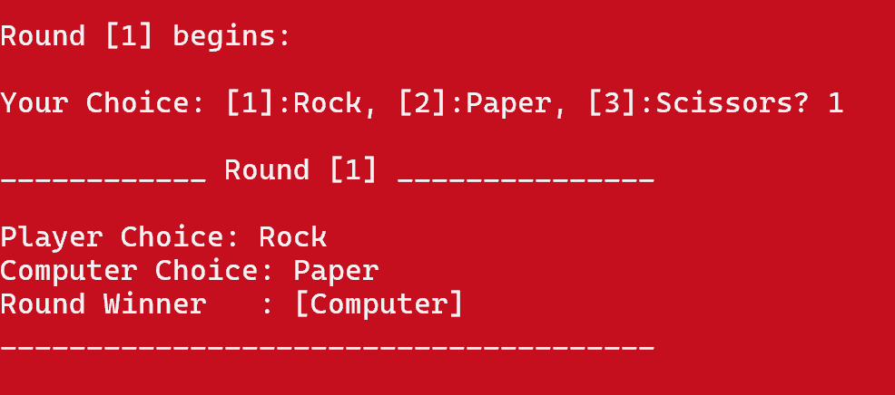
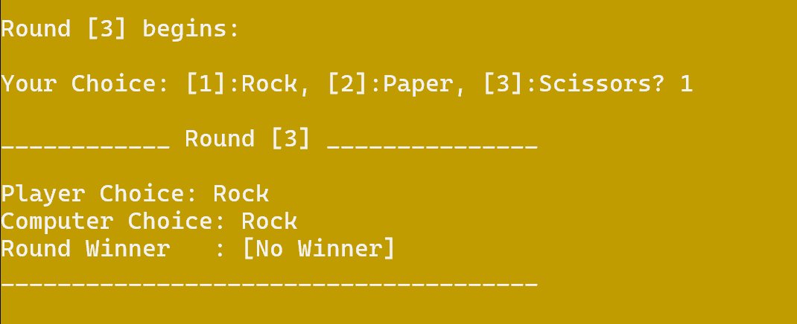
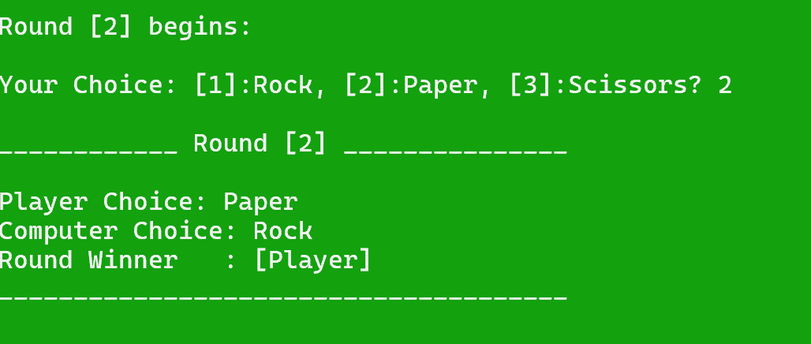

# 🪨📄✂️ Rock-Paper-Scissors Game in C++

> A simple console-based Rock-Paper-Scissors game built with C++ where the player competes against the computer.

## 📌 About

A classic Rock-Paper-Scissors game where the player chooses the number of rounds and competes against the computer. The game displays the result of each round and provides a final summary at the end.

## ✨ Features

* 🎮 Multiple rounds
* 🎲 Random computer choices
* 🏆 Round and final results
* 🎨 Colored console output
* 🔄 Replay option

## 🧠 Concepts Practiced

* Enums & Structs
* Functions
* Loops & Conditional Statements
* Random Number Generation
* Console Input & Output

## 📸 Screenshots

### 🎮 Game Start



---

### 🤖 Computer Wins



---

### 🤝 Draw



---

### 🏆 Player Wins



## 📂 Project Structure

```text
Rock-Paper-Scissors-Game
│
├── main.cpp
├── .gitignore
├── README.md
└── Screenshots/
    ├── 01-Game-Start.png
    ├── 02-Computer-Win.png
    ├── 03-Draw.png
    └── 04-Player-Win.png
```

## 🏷️ Version

**v1.0**

---

⭐ Built as part of my C++ programming practice.
